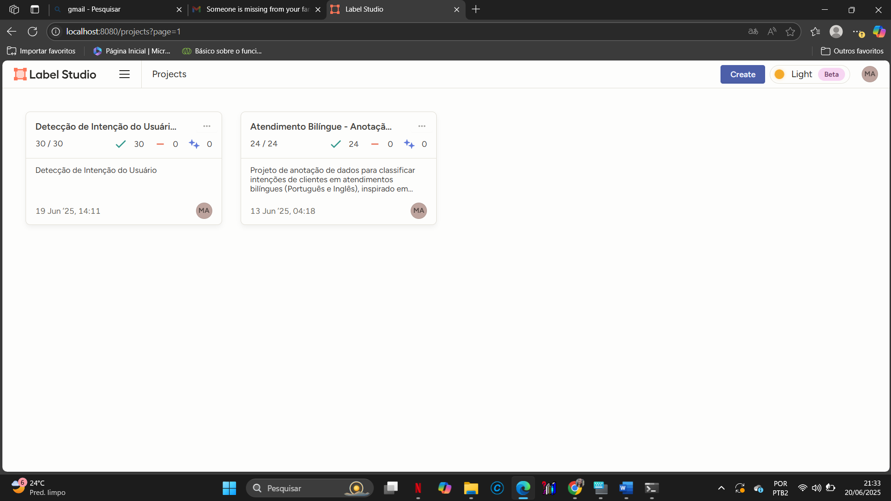
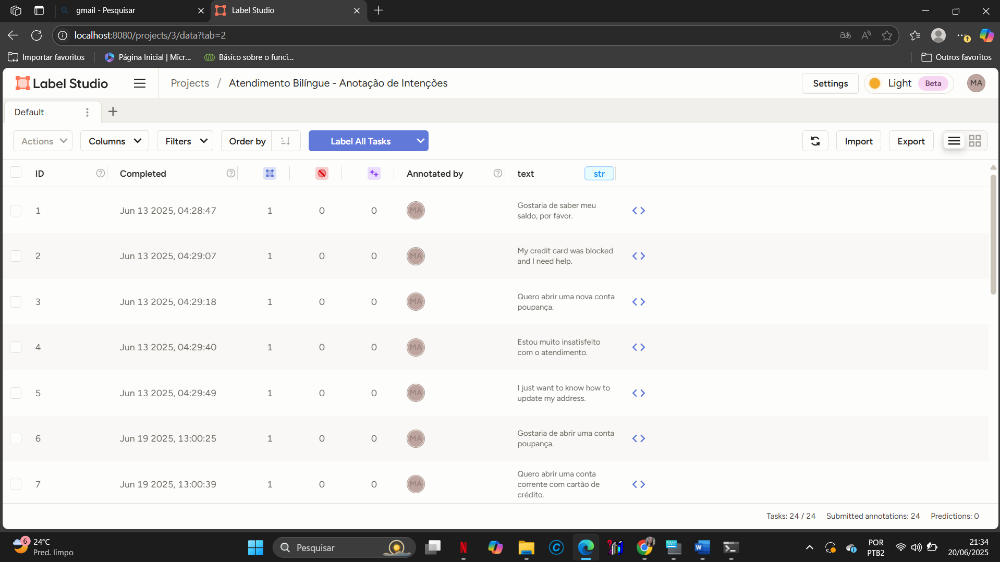
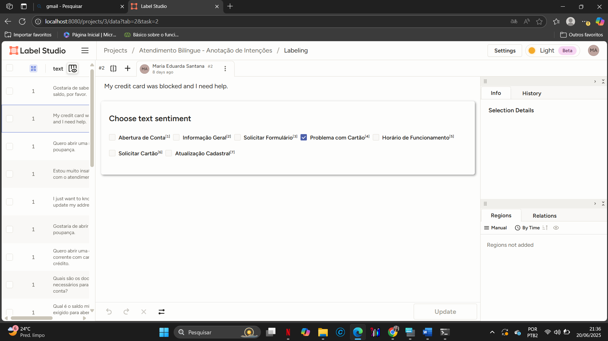

# data-annotation-banking-intent
Projeto de anotação de dados com intenções de atendimento bancário usando Label Studio. Desenvolvido como parte da minha transição de carreira para Ciência de Dados.

# Projeto de Anotação de Intenções em Atendimento Bancário

Este projeto foi criado como parte da minha transição de carreira para Ciência de Dados. Utilizei o Label Studio para realizar a anotação manual de frases comuns em atendimentos bancários, rotulando-as de acordo com a intenção do cliente.

## 🎯 Objetivo

O objetivo principal foi aplicar conceitos de anotação de dados (Data Annotation) em um contexto realista, baseado na minha experiência profissional como agente bilíngue de atendimento ao cliente.

## 🧰 Ferramentas Utilizadas

- Label Studio
- CSV
- Organização manual de intents
- GitHub

## 🗂️ Estrutura

- `data/frases_bancarias_rotuladas.csv`: contém as frases classificadas por intenção (ex: Abertura de Conta, Problema com Cartão etc.)
- `prints/`: imagens da interface do Label Studio mostrando o processo de anotação

## 🧠 Habilidades Desenvolvidas

- Pensamento analítico para rotular dados textuais
- Conhecimento de intents em Processamento de Linguagem Natural
- Organização de projetos com versionamento no GitHub
- Comunicação clara e escrita técnica

## 👩‍💻 Sobre Mim

Meu nome é Maria Eduarda Santana. Tenho formação técnica em Administração, experiência como agente bilíngue (PT/EN) no atendimento ao cliente, e atualmente curso Ciência de Dados. Estou desenvolvendo projetos práticos como este para fortalecer meu portfólio e ingressar profissionalmente na área de dados.

🔗 [Conecte-se comigo no LinkedIn](https://www.linkedin.com/in/me-santana)

## 📂 Dados do Projeto

Este repositório contém um conjunto de frases em português relacionadas a intenções comuns em atendimentos bancários, como "Abertura de Conta", "Problema com Cartão" e "Informações Gerais". Essas frases foram anotadas manualmente usando a ferramenta Label Studio.

Você pode acessar o dataset clicando no link abaixo:

🔗 [frases_anotadas_banco.csv](./data/frases_anotadas_banco.csv)

## 🖼️ Capturas de Tela

Abaixo estão algumas imagens do processo de anotação usando o Label Studio:

### 📌 Visão Geral do Projeto

### ✍️ Tarefas de Anotação

### 🧩 Configuração das Labels

### 📌 Finalidade
O arquivo CSV pode ser usado para:
- Treinar modelos de classificação de intenção
- Testar fluxos de NLP (Processamento de Linguagem Natural)
- Estudos e projetos de Data Annotation

### 🛠️ Estrutura do Arquivo
| frase                                          | intencao                |
|------------------------------------------------|--------------------------|
| Quero abrir uma conta corrente                | Abertura de Conta       |
| Meu cartão não está funcionando               | Problema com Cartão     |
| Qual o horário de funcionamento da agência?   | Horário de Funcionamento|

